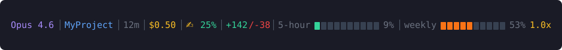

# Claude Code Status Line

A compact, information-rich status line for [Claude Code](https://docs.anthropic.com/en/docs/claude-code) that shows everything you need at a glance — model, project, session stats, context usage, and Anthropic API rate limit bars with a weekly pace indicator.

<p align="center">
  
</p>

## What It Shows

| Segment | Description |
|---------|-------------|
| <code><b style="color:#a78bfa">Opus 4.6</b></code> | Active Claude model |
| <code><b style="color:#60a5fa">MyProject</b></code> | Current project directory name |
| `12m` | Session duration |
| `$0.50` | Session cost in USD |
| `✍️ 25%` | Context window usage — 🟢 <50%, 🟠 50-70%, 🔴 70%+ with warnings |
| `+142/-38` | Lines added/removed this session |
| `5-hour ██░░░░░░░░ 9%` | 5-hour rolling rate limit with progress bar |
| `weekly █████░░░░░ 53%` | 7-day rolling rate limit with progress bar |
| `1.0x` | Weekly pace — usage% vs time elapsed% |

### Rate Limit Colors

| Usage | Color | Meaning |
|-------|-------|---------|
| 0-49% | 🟢 Green | Comfortable headroom |
| 50-69% | 🟠 Orange | Moderate usage |
| 70-89% | 🟡 Yellow | Getting close to limit |
| 90%+ | 🔴 Red | Near or at limit |

### Pace Indicator

The pace indicator shows how fast you're consuming your weekly quota relative to time elapsed:

| Pace | Color | Meaning |
|------|-------|---------|
| < 0.9x | 🟢 Green | Under pace — plenty of budget left |
| 0.9-1.1x | 🟡 Yellow | On track — using at expected rate |
| 1.1-1.5x | 🟠 Orange | Over pace — may hit limit before reset |
| > 1.5x | 🔴 Red | Burning fast — will likely hit limit |

## Installation

### One-liner

```bash
curl -fsSL https://raw.githubusercontent.com/silverdolphin863/claude-code-statusline/main/install.sh | bash
```

### Manual

1. Copy the script:

```bash
curl -fsSL https://raw.githubusercontent.com/silverdolphin863/claude-code-statusline/main/bin/statusline.sh -o ~/.claude/statusline.sh
chmod +x ~/.claude/statusline.sh
```

2. Add to `~/.claude/settings.json`:

```json
{
  "statusLine": {
    "type": "command",
    "command": "bash ~/.claude/statusline.sh"
  }
}
```

3. Restart Claude Code.

## Configuration

All settings are optional environment variables. Add them to your shell profile (`~/.bashrc`, `~/.zshrc`, etc.):

```bash
# Toggle sections on/off
export STATUSLINE_SHOW_COST=true          # Show session cost (default: true)
export STATUSLINE_SHOW_LINES=true         # Show lines added/removed (default: true)
export STATUSLINE_SHOW_RATE_LIMITS=true   # Show 5-hour and weekly bars (default: true)
export STATUSLINE_SHOW_PACE=true          # Show weekly pace indicator (default: true)

# Appearance
export STATUSLINE_CONTEXT_ICON="✍️"       # Icon before context % (default: ✍️)
export STATUSLINE_BAR_WIDTH=10            # Progress bar width in chars (default: 10)
export STATUSLINE_CACHE_TTL=300           # Rate limit cache duration in seconds (default: 300)
```

### Minimal Mode

Strip it down to just the essentials:

```bash
export STATUSLINE_SHOW_RATE_LIMITS=false
export STATUSLINE_SHOW_PACE=false
export STATUSLINE_SHOW_COST=false
```

## How It Works

1. Claude Code pipes session JSON to the script via stdin (model, context window, cost, workspace info)
2. The script reads your OAuth token from `~/.claude/.credentials.json`
3. Calls `https://api.anthropic.com/api/oauth/usage` with the `anthropic-beta: oauth-2025-04-20` header
4. Caches the API response at `~/.claude/usage-cache.json` for 300 seconds (configurable)
5. Renders everything with ANSI true-color codes (24-bit RGB)

### Dependencies

- **Node.js** (bundled with Claude Code)
- **curl** (for rate limit API calls)
- No `jq`, no `python`, no extra packages

### Security

- Only outbound call is to `api.anthropic.com` (Anthropic's own API)
- Token is read from Claude Code's own credential store
- No data is sent anywhere else — everything stays local
- Zero npm dependencies

## Compatibility

| Platform | Status |
|----------|--------|
| macOS | Tested |
| Linux | Tested |
| Windows (Git Bash / MSYS2) | Tested |
| Windows (WSL) | Should work |

Works with any terminal that supports ANSI true-color (24-bit) escape codes — iTerm2, Windows Terminal, Ghostty, Alacritty, Kitty, VS Code terminal, etc.

## Troubleshooting

**Rate limit bars show 0%:**
- Delete cache: `rm ~/.claude/usage-cache.json`
- Ensure `~/.claude/.credentials.json` exists and has a valid OAuth token
- Test manually: `echo '{"model":{"display_name":"test"}}' | bash ~/.claude/statusline.sh`

**API returns rate_limit_error:**
- The script caches for 300s by default. If it persists, increase further: `export STATUSLINE_CACHE_TTL=600`

**Garbled or missing icons:**
- Ensure your terminal font supports Unicode (Nerd Font, JetBrains Mono, Fira Code, etc.)
- Try a different context icon: `export STATUSLINE_CONTEXT_ICON="✏"`

## Credits

Inspired by [kamranahmedse/claude-statusline](https://github.com/kamranahmedse/claude-statusline). Built from scratch with a different approach — single-line layout, Node.js instead of jq, rate limit pace tracking, and full configuration via environment variables.

## License

MIT
